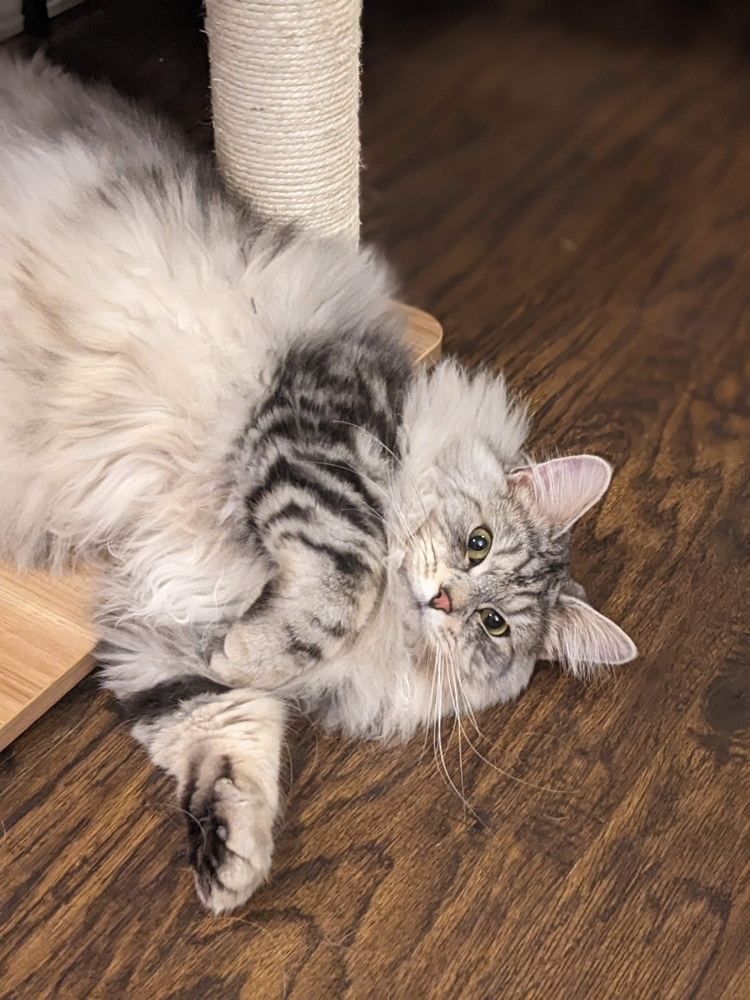

My name is Marieke Sorge. 

 

### My story

I am an early career statistician currently living in Albuquerque, New Mexico. I love reading, writing, teaching, tackling complex problems and learning in general. I recieved my Master's degree in Statistics and Bachelor's of Science degrees in Neuroscience and Biological Sciences from Arizona State University. I have a Silver Siberian Forest cat named Freddie Mercury and a Golden Retriever named Maggie. 
### Here are my animals:

  
 

